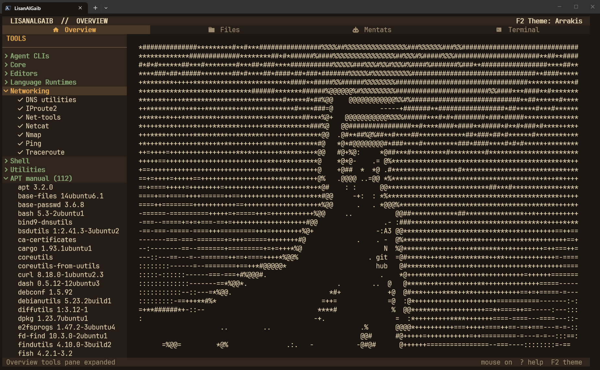
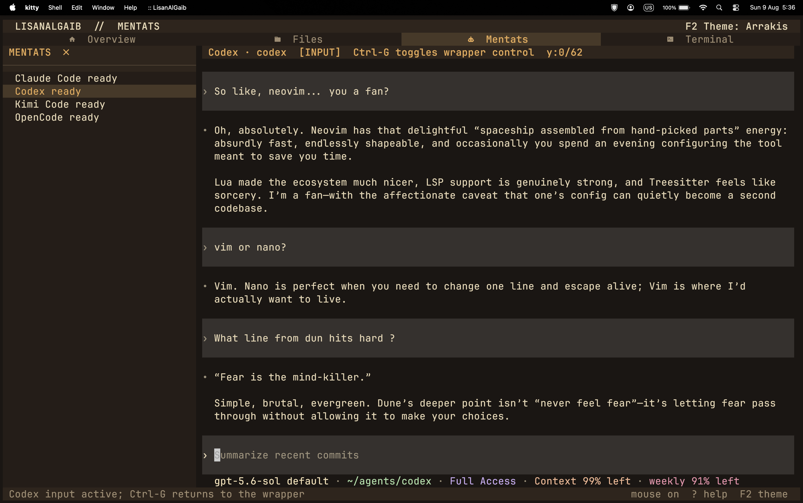
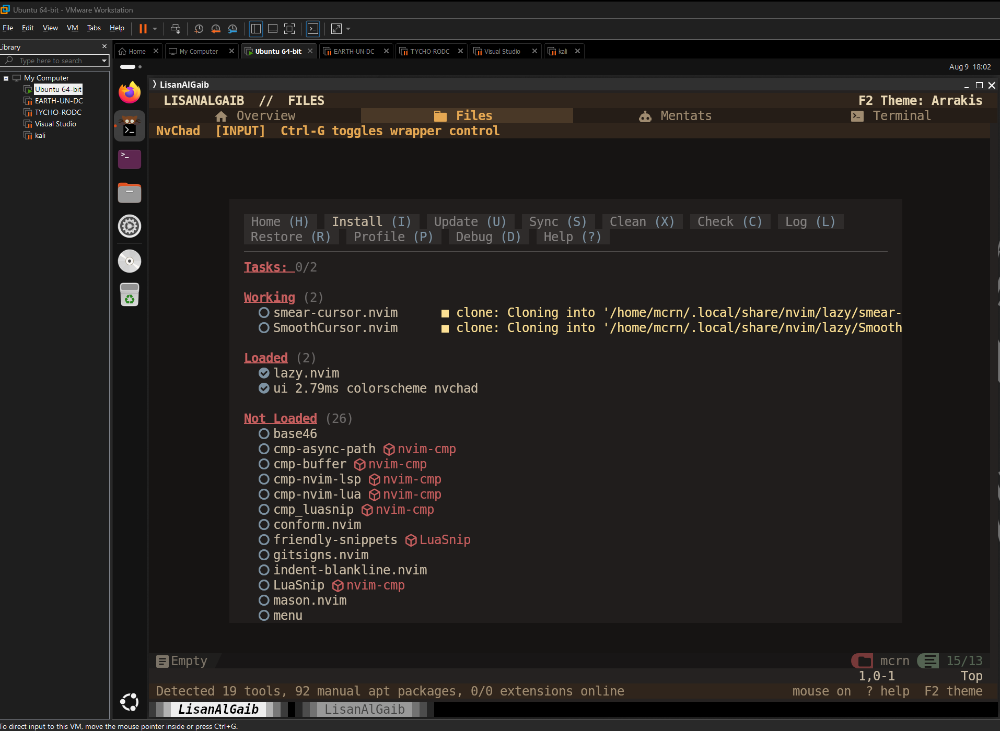
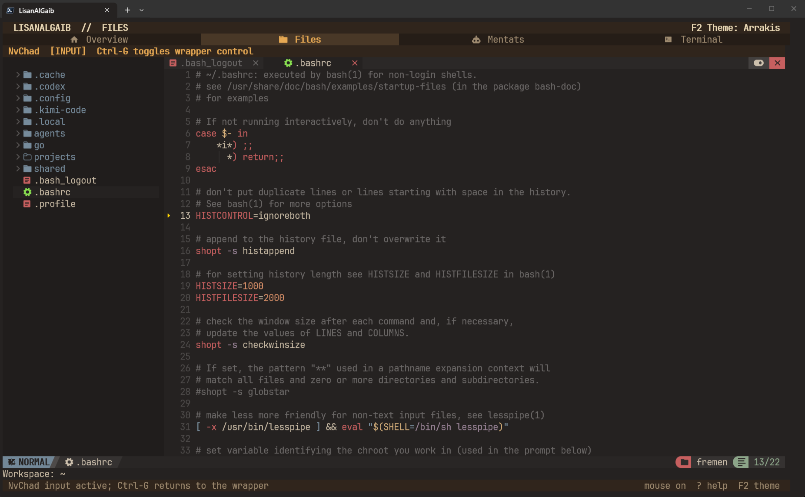
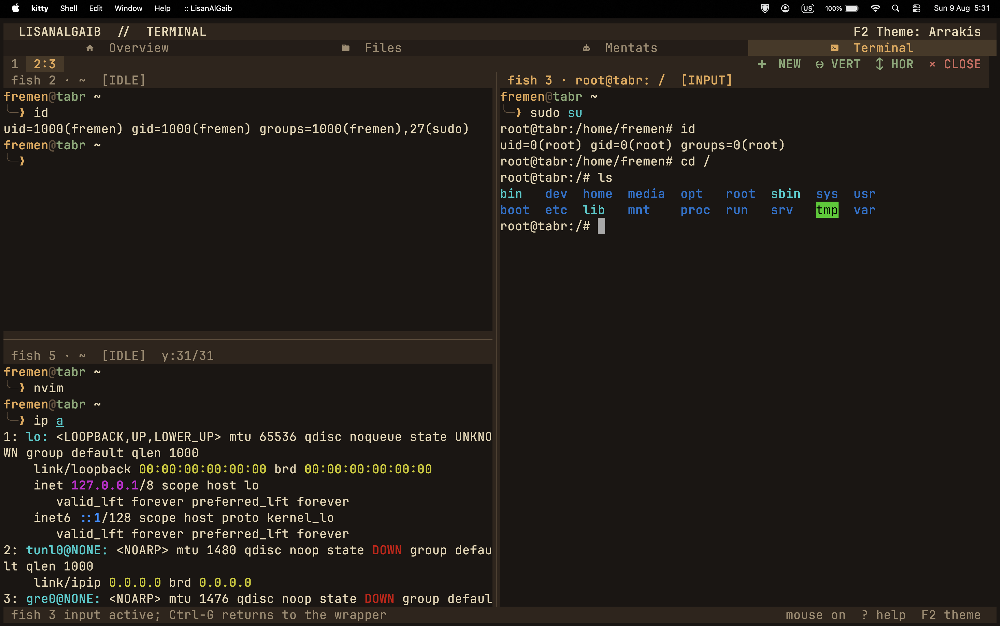
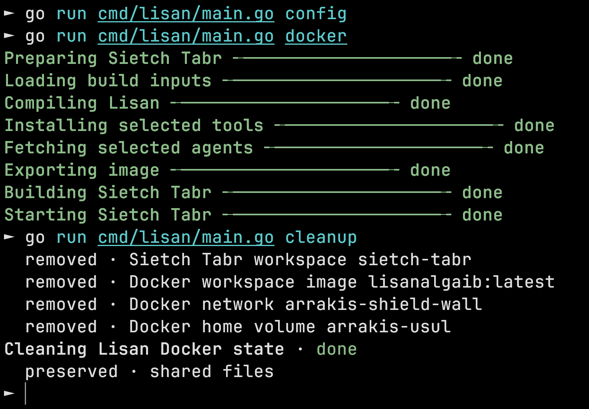
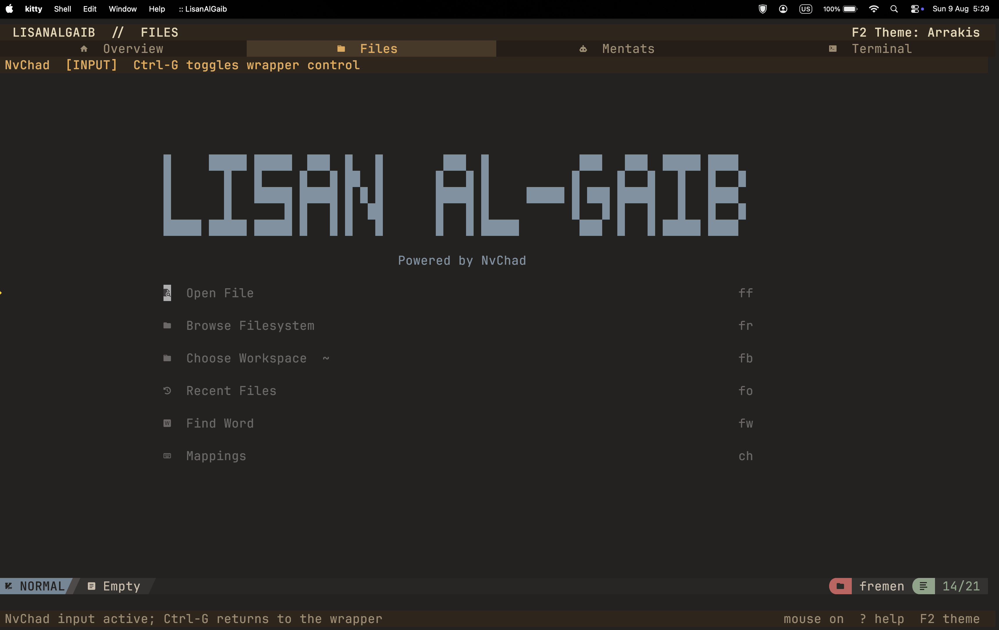
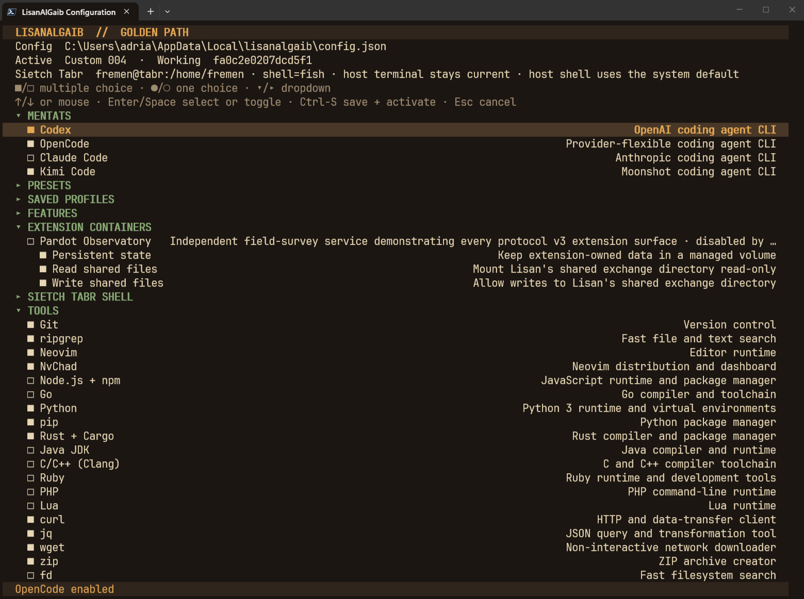

# LisanAlGaib

**Full-permission vibe coding without handing your host to the vibes. A  place for `/permissions` to be abused.



---
## Table of Contents

- [Platform Support](#platform-support)
- [Quick Start](#quick-start)
- [Commands](#commands)
- [Config](#config)
- [Extensions](#extensions)
- [The Boundary](#the-boundary)
- [Sessions and Resources](#sessions-and-resources)

---

The goal is simple: let the agents cook without fearing for your life every time
they execute a command. LisanAlGaib is a Go terminal cockpit (lol cockpit) for coding agents, editors and shells.

It has two main modes, `docker` or `vm`. Both modes give agents a persistent Linux workspace where they can install tools, run commands, and use `sudo` freely, without mounting your
host project, Docker socket, or home directory. 



---
## Platform Support

Standalone binary embeds everything Lisan needs to assemble its selected Docker workspace. Depending on your system, like windows, if you use the binary in the release, you may need to sign the binary. Otherwise compile from source using Go. 

| Tested platforms |  arch   |
| ---------------- | :-----: |
| Windows (vmware) | `amd64` |
| Windows (docker) | `amd64` |
| MacOS (docker)   | `arm64` |
### Windows (vmware):

_Virtual machine running Ubuntu._
### Windows (docker)

### MacOS (docker)

_I would not recommend installing with the `vm` argument on your host, as this removes the isolation and defeats the purpose. _

---
## Quick start

**Manual:**
```bash
go run .\cmd\lisan\main.go
```

**Release:**
```bash
chmod +x ./lisan_linux_amd64
./lisan_linux_amd64 install
lisan config
lisan docker
```

**Windows PowerShell:**
```powershell
./lisan_windows_amd64.exe install
lisan config
lisan docker
```
_Might need script exec bypass as well as signing the binary, should you use a release._

---
## Commands

```text
lisan docker              isolated Docker workspace (recommended)
lisan vm                  full permissions as the current host user (unsafe)
lisan config              choose features, tools, agents, shell, and extensions
lisan cleanup             remove owned Docker state; preserve shared files
lisan install             install the binary and embedded runtime
lisan uninstall           remove the binary/runtime; preserve user data
lisan help | -h | --help  show command help
```

`docker` runs the docker container, including extensions. Lisan deliberately does not hardcode CPU or memory limits. That avoids quietly starving a heavy build and lets the same release fit laptops and workstations. Set the Docker VM's CPU, memory, swap, disk, and idle behavior in [Docker Desktop settings](https://docs.docker.com/desktop/settings-and-maintenance/settings/); [Resource Saver](https://docs.docker.com/desktop/use-desktop/resource-saver/) can reduce idle Desktop usage. On Linux, tune the Docker host itself.

`vm` is like "Wormsign mode". Despite the name, it is not a virtual machine: agents run
directly as your host user. Use it only when you intentionally want host access or when running in a virtual machine. 

`config` is used to set what tooling/features you want to use within Lisan. This includes dynamic crawling for [Extensions](README.md#extensions) to use. See [Config](README.md#Config)

`cleanup` removes Lisan-owned containers, images, networks, and the persistent Usul volume. It preserves the host `shared/` directory.

`install/uninstall` is used when you want the binary embedded runtime and so on to be added/removed from the path. Alternative to not running the command with the following:

```sh
go run cmd/lisan/main.go help
```

`help` helps. 


_After running the `docker/vm_` argument, the tool will make use of your terminal session until `CTRL+C` on the overview page. 


---
## Config

- Codex, OpenCode, Claude, and Kimi agent CLIs
- Common language runtimes, package managers, network diagnostics, and workspace utilities
- Fish, Bash, Zsh, or POSIX `sh` inside Docker
- Manifest-driven extensions, disabled by default
- Minimal through full presets, with profile-aware Docker layer reuse



The TUI stays inside the terminal that launched it. Lisan does not choose your terminal or host shell. A Nerd Font is recommended for interface icons. The Tools inventory lives in a collapsed pane on Overview; click the active Overview tab again to reveal or hide it. 

---
## Extensions

Extension authors can start with the modular authoring guide in [docs/extensions.md](docs/extensions.md); the exact versioned wire protocol is documented in [docs/connectors.md](docs/connectors.md).

See [example extension](extensions/pardot-observatory/README|README) for a better vibe.

---
## The boundary

```text
Your terminal
  └─ Docker
      └─ Sietch Tabr
          ├─ coding agents with full container permissions
          ├─ NvChad and your selected shell
          ├─ /home/fremen/projects     persistent container projects
          ├─ /home/fremen/shared       explicit host exchange folder
          └─ no host Docker socket, home, or implicit project mount
```

The Usul Docker volume preserves the container home between launches. The only host bind mount is `shared/`, making file exchange deliberate and easy to audit. Anything placed there can be read, changed, or deleted by code in the container.

```bash
lisan cleanup
```

Cleanup removes Lisan-owned containers, images, networks, and the persistent
Usul volume. It preserves the host `shared/` directory. Docker is the recommended boundary for untrusted repositories, plugins, installers, and agent-generated commands. A malicious package can own the workspace, its credentials, the Usul volume, and `shared/`; it should not gain a
normal filesystem path to the rest of the host. Docker escape vulnerabilities, network access, and resource exhaustion remain outside that promise. Keep secrets and sensitive files outside the sandbox and read the exact threat model in [SECURITY.md](SECURITY.md).

---

## Sessions and resources

Changing tabs does not restart shells, agents, the editor, or extension sessions. Shells and agents may keep working in the background; on Unix the hidden editor is paused to avoid idle redraw work. Closing the last Docker cockpit stops Lisan's containers, while their container state and named volumes remain ready for the next launch. Background processes do not survive that
stop. `cleanup` is the destructive reset.

Host terminal paste shortcuts work in an active Mentat, editor, or terminal pane. Lisan forwards each paste as a single bracketed-paste operation, so multiline text keeps the semantics expected by shells and full-screen apps. Press `Ctrl-G` or click the pane to activate input first. Because Lisan enables mouse interaction, use your terminal's selection override (often `Shift` while dragging) when selecting text to copy. Mentats and terminal panes each retain their own wrapper scroll position; use the wheel, `PgUp`/`PgDn`, or `Home`/`End` to move through their output history while wrapper controls are active.

The Terminal toolbar can create multiple persistent in-app terminal tabs, split the active pane vertically (left/right) or horizontally (top/bottom), and close the active pane. Clicking a pane focuses it, so keyboard input, paste, mouse events, the cursor, resizing, and scrollback all target that pane. These are panes inside Lisan; it never opens or replaces a host OS terminal window.